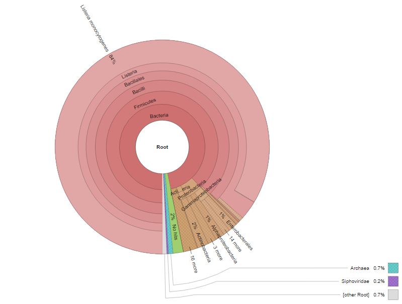
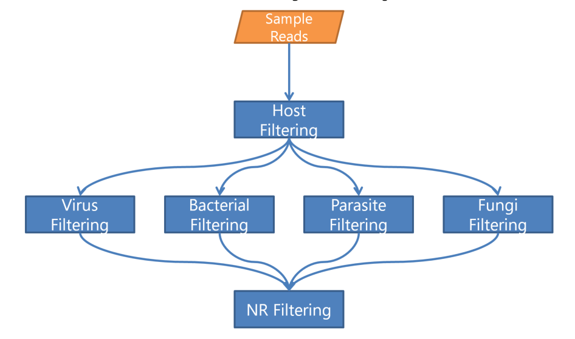
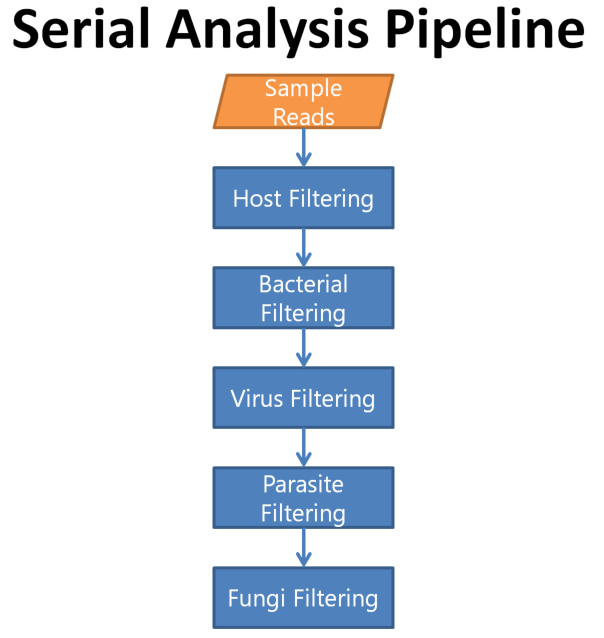

To beginning we will setup our environment in our ~/workspace so we can view our result using the web browser.

```
export WORK_DIR=~/workspace/module6/

mkdir -p $WORK_DIR
cd $WORK_DIR
ln -s ~/CourseData/IDGE_data/EPD_IMS .
mkdir $WORK_DIR/ex1 $WORK_DIR/ex2 $WORK_DIR/ex3
```


## Table of contents
1. [Introduction](#intro)
2. [Software](#software)    
2. [Environment Setup](#env)
3. [Exercise 1](#ex1)
4. [Exercise 2](#ex2)
5. [Exercise 3](#ex3)


<a name="intro"></a>
## Introduction


<a name="software"></a>
## List of softwares for tutorial

* [Kraken](https://ccb.jhu.edu/software/kraken/)
* [KAT](https://kat.readthedocs.io/en/latest/)
* [Krona](https://github.com/marbl/Krona/wiki)
* [SPAdes](http://cab.spbu.ru/software/spades/)
* [NCBI blast](https://blast.ncbi.nlm.nih.gov/Blast.cgi?PAGE_TYPE=BlastSearch)
 

To begin, we will setup our environment in our ~/workspace so we can view our progress using the web browser.

<a name="env"></a>
## Environment setup


```bash
export WORK_DIR=~/workspace/module6/

mkdir -p $WORK_DIR

cd $WORK_DIR

ln -s ~/CourseData/IDGE_data/EPD_IMS .

mkdir $WORK_DIR/ex1 $WORK_DIR/ex2 $WORK_DIR/ex3

```

<a name="ex1"></a>
## Exercise 1


### Patient Background:

On (e.g.) April 27, a 66-year old male was admitted to a local ER. He presented with stiff neck and muscle aches. CBC revealed elevated white blood cell count, neutrophils, etc. The hospital epidemiologist was consulted to confirm the clinicians’ findings. 


### Demonstration:

* Filter host reads with KAT
* Run Kraken with mini kraken database from RefSeq
* Generate text and graphic reports with Kraken and Krona


---


### Step 1: Host reads filtering

The first step in this demonstration is to remove the host reads from the dataset prior to downstream analyses. There are several different tools that can be used to filter out host reads such as Kraken, BLAST, KAT and others. In this demonstration, we have selected KAT because of the smaller memory requirement compared to Kraken and relatively quick speed.

Command documentation is available [here](http://kat.readthedocs.io/en/latest/using.html#sequence-filtering)

```bash
cd $WORK_DIR/ex1

kat filter seq -i -o unmatched --seq ../EPD_IMS/reads/ex1/ex1_R1.fastq --seq2 ../EPD_IMS/reads/ex1/ex1_R2.fastq ../EPD_IMS/kat_db/human_kmers.jf

```
### Command arguments:

```--seq --seq2``` arguments to provide corresponding forward and reverse fastq reads

```-i``` whether to output sequences not found in the kmer hash, rather than those inside. 

```-o umatched ``` Provide prefix for all files generated by the command. In our case, we will have two output files **unmatched.in.R1.fastq** and **umatched.inR1.fastq**.


After the above command is done running, you should see similar output on your screen as shown below.


```
Kmer Analysis Toolkit (KAT) V2.3.3

Running KAT in filter sequence mode
-----------------------------------

Loading hashes into memory... done.  Time taken: 57.5s

Filtering sequences ...
Finished filtering.  Time taken: 14.2s

Found 32546 / 84573 to keep

KAT filter seq completed.
Total runtime: 71.8s
```


If the command was successful, your current directory should contain two new files:

* unmatched.in.R1.fastq
* unmatched.in.R2.fastq

---


### Step 2: Classify reads against mini kraken database


Now that we have most, if not all, host reads filtered out, it’s now time to classify the remaining reads. Database(s) selection is one of the most crucial parts of running Kraken. One of the many factors that must be considered are the computational resources available. Our current AWS image for the course has only 16G of memory.

Though a popular database, a major disadvantage of Kraken is that it loads the entire database into memory. To help mitigate this, Kraken also provides a database, [minikraken](https://ccb.jhu.edu/software/kraken/dl/minikraken.tgz), which has been developed with these restrictions in mind. It is composited of a subset of complete bacterial, archaeal and viral genomes in RefSeq, with a total memory footprint of 4GB.


Now lets run the following command in our current directory to classify our reads against the minikraken database.


```bash
kraken --paired --threads 4 --db ../EPD_IMS/kraken_db/minikraken unmatched.in.R1.fastq unmatched.in.R2.fastq > results_initial.txt

```

After the above command is done running, you should see similar output on your screen as shown below.


```

32546 sequences (14.33 Mbp) processed in 60.511s (32.3 Kseq/m, 14.21 Mbp/m).
  32040 sequences classified (98.45%)
  506 sequences unclassified (1.55%)
    

```

We can try to take a look at the first 10 lines of output file results_initial.txt,


```
head results_initial.txt
```

though, these results are not really meant for human readable format. Each line in the report is an individual read on  well it mapped to entries in the database.
Documentation is brief but in sufficent detail available [here](https://ccb.jhu.edu/software/kraken/MANUAL.html#output-format) and is subject to the following questions...

---
### Questions

1) What is the 'C' value in the first column indicate?

2) What is the value if a sequence is marked as unclassified?


Let’s generate something that would by running the Kraken-report command.

---
### Step 3: Generate text-based report using Kraken-report.

```bash

kraken-report  --db ../EPD_IMS/kraken_db/minikraken results_initial.txt > final_report.txt

```

Let’s look at the generated text report from Kraken-report by opening a web browser on your laptop, and navigate to http://cbwXX.dyndns.info/, where XX is your student id. You should be able to find the file in directory hierarchy under ~/workspace/modules6/ex1/ and open file final_report.txt

Now that the kraken report is easier to understand and interpret than the previous output from Kraken, it is still not as interactive as it can be.

That is where Krona comes in; Krona generates an interactive html web page that allows hierarchical data to be explored with zooming, multi-layered pie charts and other added features.


---
### Step 4: Generate interactive html based report using Kraken-report.

```bash

cut -f2,3 results_initial.txt > krona_input.txt

ktImportTaxonomy krona_input.txt -o final_web_report.html

```

Let’s look at what Krona generated.

Return to your web browser and refresh the page from Step 3 to see the new files added in ~/workspace/modules6/ex1 directory.

Click on final_web_report.html and you should see the image below.




---
### Questions


The following warning messages were output from ktImportTaxonomy
```
   [ WARNING ]  The following taxonomy IDs were not found in the local database and were set to root (if they were recently added to NCBI, use updateTaxonomy.sh to update the local
                   database): 245018 1054400
Writing final_web_report.html...
   [ WARNING ]  Too many query IDs to store in chart; storing supplemental files in 'final_web_report.html.files'.

````
1) Why do you think that taxonomy ID 245018 and 1054400 are missing?


2) What do you mean of the second warning message? Will it affect the results?

3) In the kraken-report file, final_report.txt, there was a small percentage of the reads that were  were unclassified. What do you think that is? Is it important?


---
<a name="ex2"></a>
## Exercise 2


### Background:

Patient


### Demonstration:

* Filter host reads with KAT
* Run Kraken with separate specific bacterial and virus databases
* Generate text and graphic reports with Kraken and Kronatools


---
### Step 1: Host reads filtering

Same instruction as listed in Exercise 1, Step 1 but using dataset found in ex2 folder.


```bash
cd ~/workspace/module6/ex2/

kat filter seq -i -o unmatched --seq ../EPD_IMS/reads/ex2/ex2_R1.fastq --seq2 ../EPD_IMS/reads/ex2/ex2_R2.fastq ../EPD_IMS/kat_db/human_kmers.jf

```

---
### Step 2: Classify reads against bacterial kraken database


In this example we are going to use multiple larger databases instead of the single smaller minikraken. Since minikraken is only a subset of what is available of refSeq, we do not want to miss anything that may be present in our sample and not in our database. Our approach this time around will be parallel analysis pipeline as shown in image below.





For the sake of time and complexities, we will only run though viral and bacterial databases. Let’s start with the bacterial database.


```bash
kraken --paired --threads 4 --db  ../EPD_IMS/kraken_db/bacterial unmatched.in.R1.fastq  unmatched.in.R2.fastq  > results_bacterial.txt

kraken-report  --db ../EPD_IMS/kraken_db/bacterial results_bacterial.txt > results_bacterial_report.txt

```


Let’s open up the file ~/workspace/modules6/ex2/results_bacterial_report.txt in the web browser to see what happen.

Looks like most if not all the reads were marked as unclassified. One logical answer would be that our bug is not present in our database. Since we ran our reads against a bacterial only database, perhaps we should try the viral one next?


---
### Step 3: Classify reads against viral kraken database

One note here that we are running on the reads generate from KAT and not output from the previous Kraken run. These are independent but parallel runs on the **same** data from KAT.

```bash
kraken --paired --threads 4 --db  ../EPD_IMS/kraken_db/viral unmatched.in.R1.fastq  unmatched.in.R2.fastq  > results_viral.txt

kraken-report  --db ../EPD_IMS/kraken_db/viral results_viral.txt > results_viral_report.txt

```


Let’s open up the file ~/workspace/modules6/ex2/results_viral_report.txt in the web browser to see what happen. Looks like that a large chunk of our reads matched the Orthopoxvirus Genus but nothing specific.


### Questions

1) How can you explain the large amount unclassified reads in results_viral_report.txt?

2) With the resutls_viral_report, can you indicate for sure which species is our suspect? Why or why not?


---
<a name="ex3"></a>
## Exercise 3


### Background:

Patient


### Demonstration:


* Filter host reads with KAT
* Run Kraken with separate specific bacterial and virus databases
* Pull unclassified reads from Kraken
* Generate assembly with SPAdes
* NCBI blast contigs


---
### Step 1: Host reads filtering

Same instruction as listed in Exercise 1, Step 1 but using dataset found in ex3 folder.


```bash
cd ~/workspace/module6/ex3/

kat filter seq -i -o unmatched --seq ../EPD_IMS/reads/ex3/ex3_R1.fastq --seq2 ../EPD_IMS/reads/ex3/ex3_R2.fastq ../EPD_IMS/kat_db/human_kmers.jf

```

---
### Step 2: Classify reads against bacterial database





```bash
cat unmatched.in.R1.fastq unmatched.in.R2.fastq > unmatched.fastq

kraken --threads 4 --db  ../EPD_IMS/kraken_db/bacterial unmatched.fastq  --unclassified-out unclassified_bact_reads.fastq > results_bacterial.txt

kraken-report  --db ../EPD_IMS/kraken_db/bacterial results_bacterial.txt > results_bacterial_report.txt

```

Take a look and see that almost everything is unclassified reads… try the virus?


---
### Step 3: Classify reads against viral kraken database

Now attempt to run the virus database on same output from unclassified reads from kraken bacterial.

```bash
kraken --threads 4 --db  ../EPD_IMS/kraken_db/viral  unclassified_bact_reads.fastq --unclassified-out unknown.fastq  > results_viral.txt

kraken-report  --db ../EPD_IMS/kraken_db/viral results_viral.txt > results_viral_report.txt

```

Nothing again! Take the unclassified reads and run spades to see what we get.

---
### Step 4: Generate raw assembly with unclassified reads

Use SPAdes.py to assembly the unknown reads together and see what you get

```bash
spades.py  -s unknown.fastq -o assembly_results


```


When its done, lets try to blast the first few lines of the assembly_results/contigs.fasta file using NCBI blast 


---
### Step 4: BLAST partial contig(s) against NT database

Blast subset of contig against NCBI NT database online

```bash

head -n 10 assembly_results/contigs.fasta > subset.fasta

```

Navigate to [NCBI Blast](https://blast.ncbi.nlm.nih.gov/Blast.cgi?PAGE_TYPE=BlastSearch)
